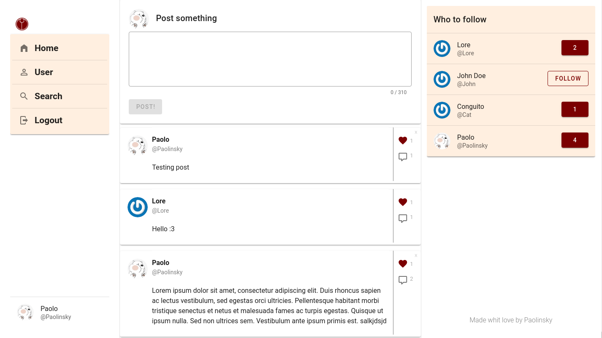
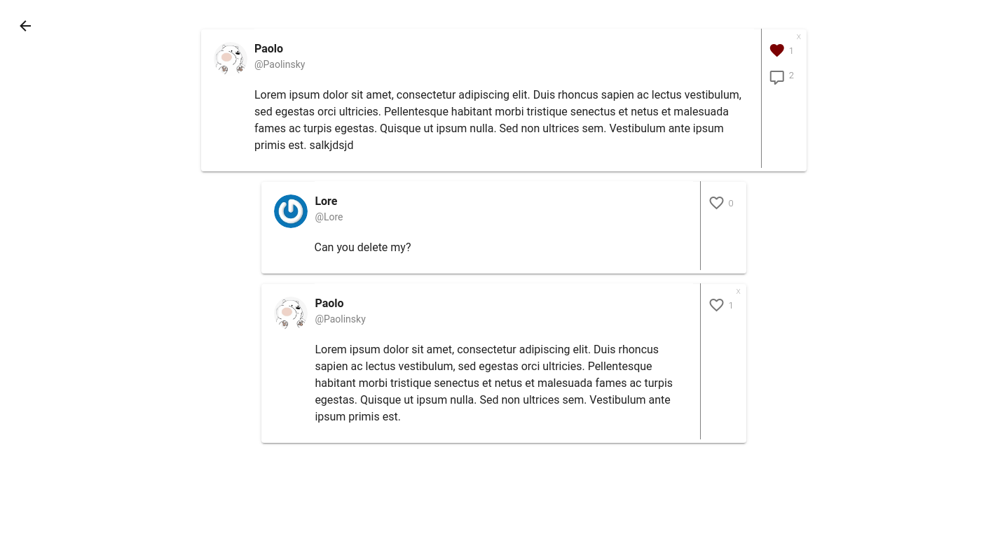
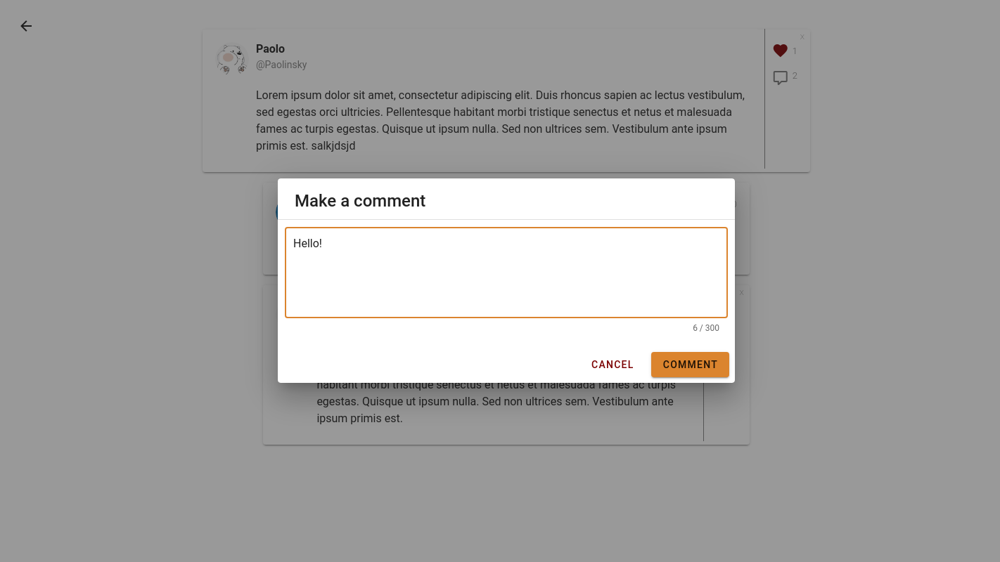

# tau-connect-vue

Made by Paolinsky (Paolo Torregroza)

[Linkedin](https://www.linkedin.com/in/paolo-donato-torregrosa-navarro-61947a191)

[Twitter](https://twitter.com/TorregrozaPaolo)

[Web Site](https://paolotorregroza.netlify.app/)

## About the project
This is a social network project made whit vuejs/typescript. (Take a look to the [deployed version](https://sleepy-pike-f4ce0e.netlify.app/))

I still working on this project.

You can found the code of the backend [here](https://github.com/PaoloTorregroza/tau-connect-backend) (It is made whit express/typescript and postgresql)

### Screenshots
Home Page

Single Comment

Comment Writer

User Settings

Register

